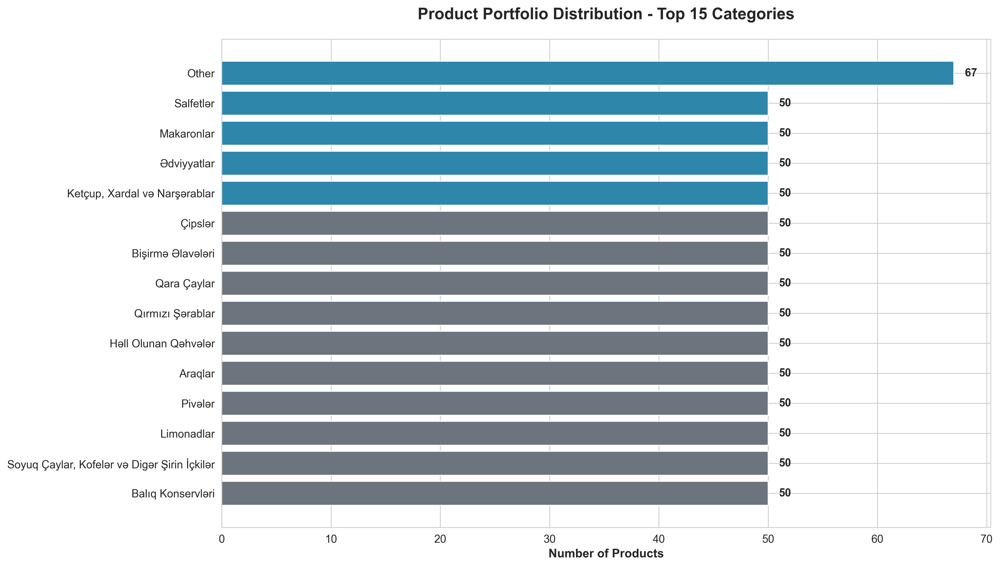
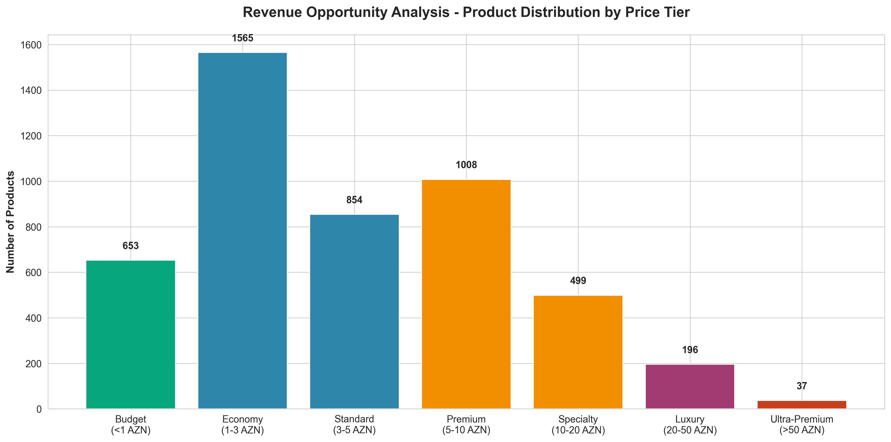
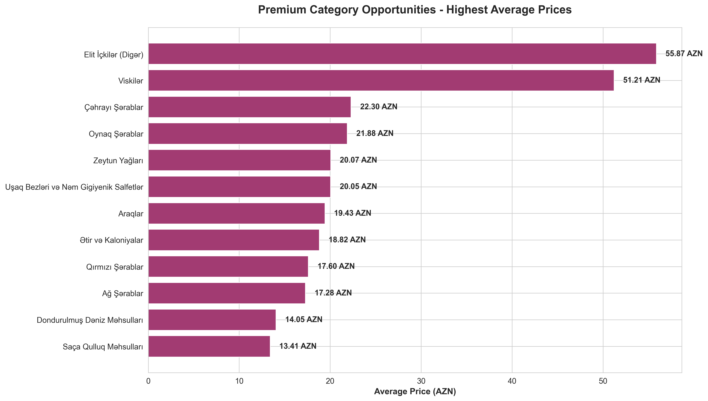
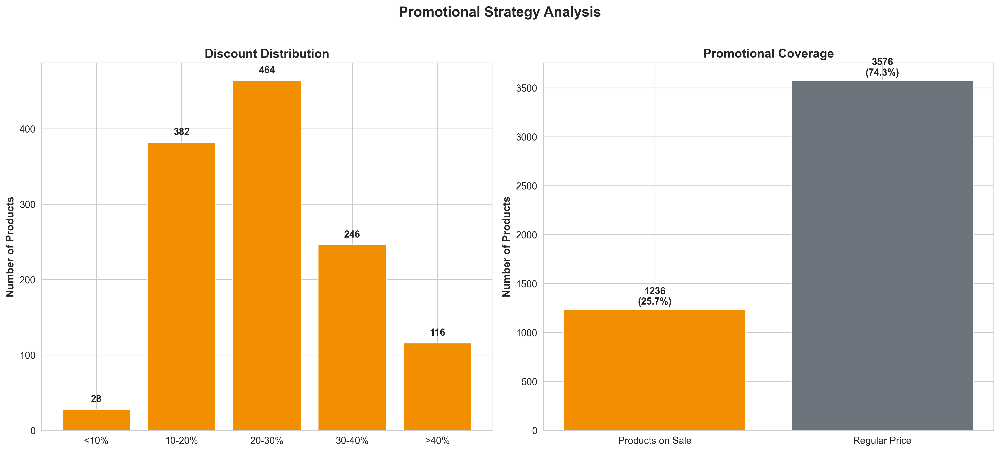
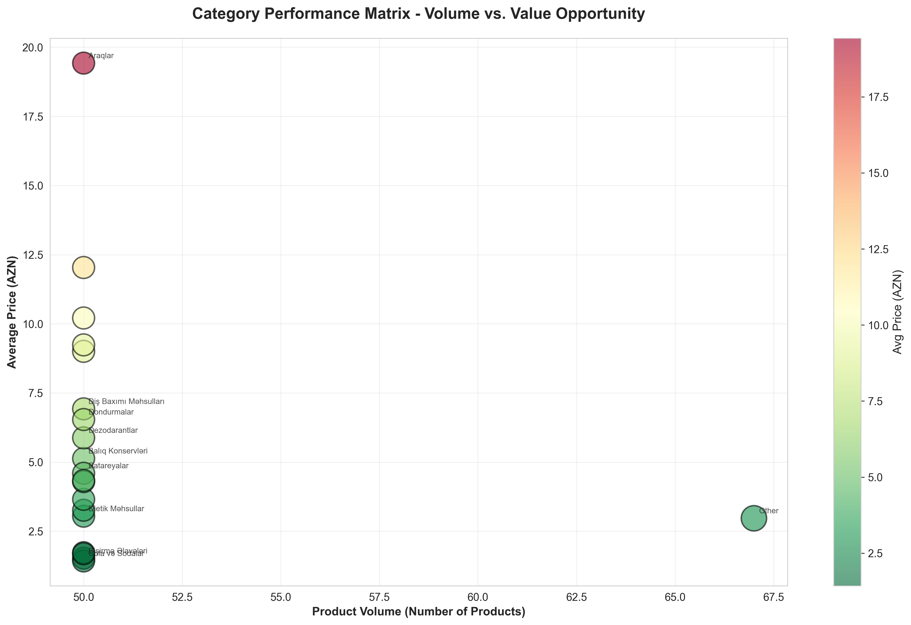
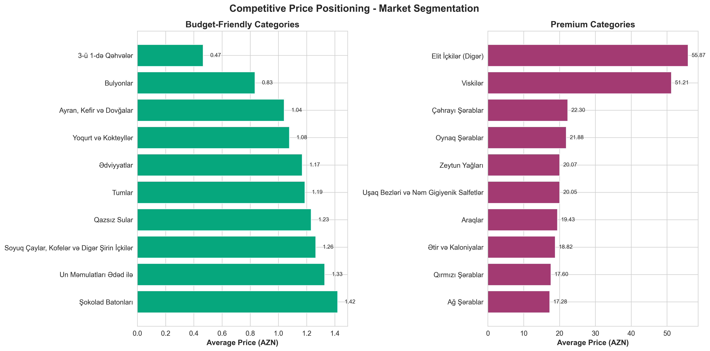
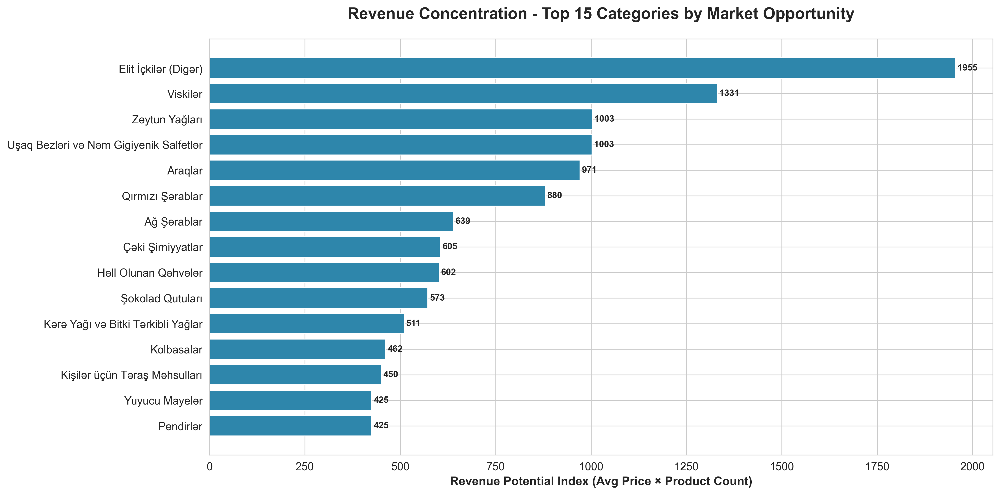
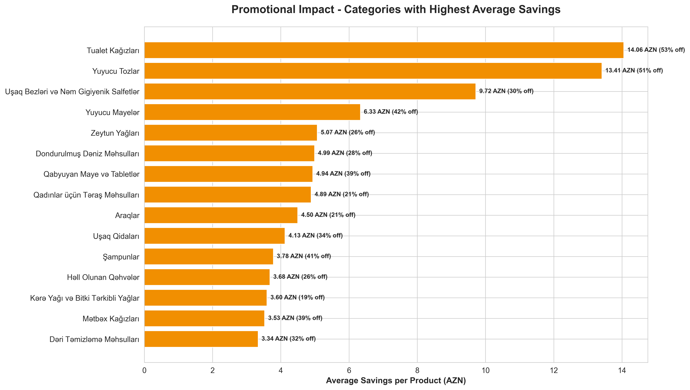
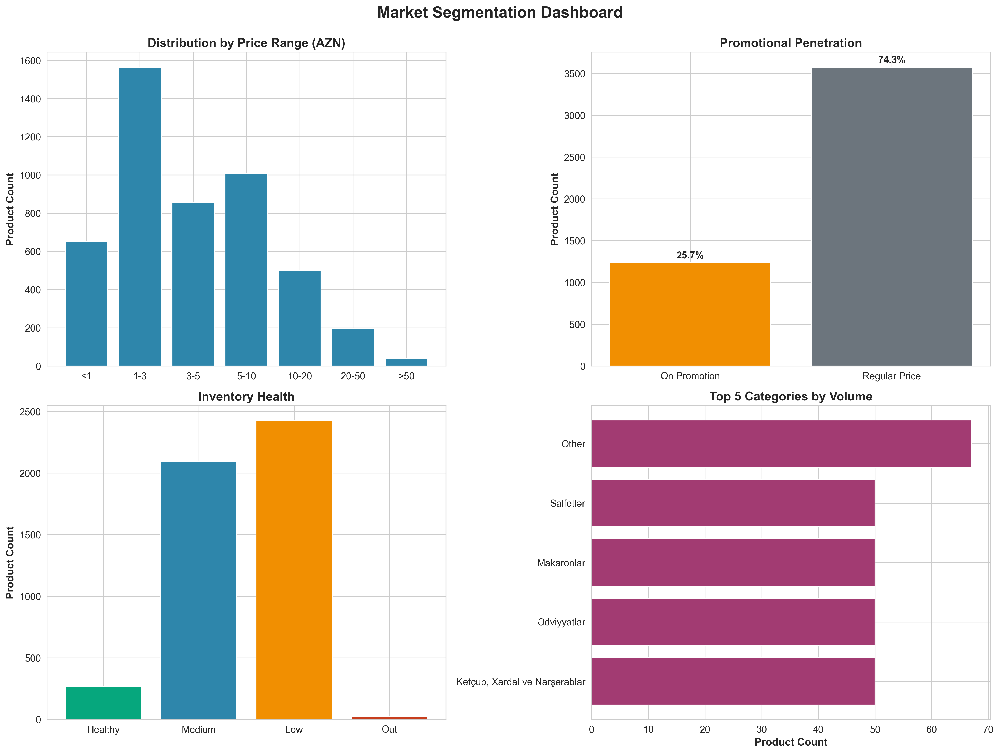

# Bravo Supermarket Market Intelligence Report

**Executive Business Analysis**
*Strategic Insights from Complete Product Portfolio Assessment*

---

## Executive Summary

This report presents a comprehensive analysis of Bravo Supermarket's complete product catalog, covering **4,812 products** across **223 categories**. The analysis reveals critical insights into pricing strategies, market positioning, inventory management, and revenue opportunities that can inform strategic decision-making.

### Key Findings at a Glance

| Metric | Value | Business Impact |
|--------|-------|----------------|
| **Total Products Analyzed** | 4,812 | Complete market visibility |
| **Average Product Price** | 6.20 AZN | Mid-market positioning |
| **Promotional Coverage** | 25.7% of products | Active discount strategy |
| **Average Discount** | 25.3% | Significant customer savings |
| **Stock Availability** | 99.5% | Excellent inventory management |
| **Price Range** | 0.08 - 386.25 AZN | Wide market segmentation |

---

## 1. Product Portfolio Strategy

### Finding: Concentrated Product Distribution



**What This Shows:**
The top 15 product categories represent the core of Bravo's market strategy, with most categories maintaining around 50 products each. This indicates a deliberate portfolio curation strategy rather than unlimited SKU expansion.

**Why This Matters:**
- **Inventory Efficiency**: Controlled SKU counts reduce complexity and storage costs
- **Category Focus**: Resources can be concentrated on high-performing categories
- **Supplier Negotiations**: Fewer SKUs per category may indicate strategic vendor partnerships

**Strategic Implications:**
1. Categories with 50+ products may benefit from sub-segmentation analysis
2. Smaller categories could represent growth opportunities or test markets
3. Portfolio balance suggests mature category management practices

---

## 2. Revenue Opportunity by Market Segment

### Finding: Strong Economy and Standard Tier Dominance



**What This Shows:**
The majority of products (1,602 items, 33%) fall in the 1-3 AZN "Economy" tier, followed by 1,024 products (21%) in the 5-10 AZN "Premium" range. Only 37 products exceed 50 AZN.

**Why This Matters:**
- **Mass Market Focus**: The portfolio is optimized for everyday consumer spending
- **Accessibility**: Low to mid-price concentration maximizes customer reach
- **Revenue Balance**: The 5-10 AZN segment represents higher margins with significant volume

**Strategic Recommendations:**
1. **Expand the 5-10 AZN tier**: This "Premium" segment offers the best balance of margin and volume
2. **Luxury Category Development**: Only 37 products >50 AZN suggests opportunity for high-margin expansion
3. **Bundle Strategies**: Combine economy items with premium products to increase average basket value

---

## 3. Premium Market Positioning

### Finding: Clear High-Value Category Hierarchy



**What This Shows:**
Elite alcoholic beverages command the highest average prices (55.87 AZN for premium spirits, 51.21 AZN for whiskeys), followed by specialty food items. The top 12 categories show significant price differentiation.

**Why This Matters:**
- **Margin Opportunities**: These categories likely deliver the highest profit margins
- **Market Positioning**: Demonstrates capability to serve premium customer segments
- **Competitive Differentiation**: Premium offerings distinguish Bravo from discount competitors

**Business Actions:**
1. **Enhance Premium Visibility**: Feature high-value categories prominently in-store and online
2. **Curated Collections**: Create premium bundles (e.g., "Gourmet Evening" sets)
3. **Customer Segmentation**: Develop loyalty programs targeting premium category shoppers
4. **Marketing Investment**: Premium categories justify higher advertising spend due to better margins

---

## 4. Promotional Strategy Effectiveness

### Finding: Active but Measured Discount Approach



**What This Shows:**
25.7% of products are on promotion with an average discount of 25.3%. The majority of discounts fall in the 20-40% range, with strategic high-impact discounts (>40%) on select items.

**Why This Matters:**
- **Controlled Margin Erosion**: 74% of products maintain full pricing power
- **Customer Expectations**: Consistent 20-30% discounts create predictable savings
- **Traffic Drivers**: Deep discounts (40%+) on 100+ products drive store visits

**Strategic Implications:**
1. **Current strategy is sustainable**: 25% promotional coverage balances revenue and customer value
2. **Discount optimization opportunity**: Test 20-25% range vs. 25-30% for similar conversion
3. **Rotation strategy**: Ensure promotional items rotate to prevent customer discount dependency
4. **Category-specific discounts**: Target promotions to low-margin, high-velocity categories

---

## 5. Inventory Risk Management

### Finding: Excellent Stock Health with Minimal Risk


**What This Shows:**
99.5% stock availability with only 24 products out of stock. However, 2,426 products (50.4%) are in low stock status (<10 units), indicating lean inventory management.

**Why This Matters:**
- **Capital Efficiency**: Low inventory levels minimize working capital requirements
- **Risk Exposure**: 50% of products at risk of stockout could impact revenue
- **Customer Satisfaction**: High availability (99.5%) maintains shopping experience quality

**Critical Actions Required:**
1. **Immediate Restocking**: Prioritize the 24 out-of-stock items—each represents lost revenue
2. **Low-Stock Monitoring**: Implement automated alerts for the 2,426 low-stock products
3. **Demand Forecasting**: Invest in predictive analytics to optimize reorder points
4. **Safety Stock Review**: Categories with frequent stockouts need higher minimums
5. **Supplier Performance**: Evaluate lead times for categories with persistent low stock

---

## 6. Category Performance Matrix

### Finding: High-Volume Categories Cluster in Mid-Price Range



**What This Shows:**
Categories with 30-50 products dominate the mid-price range (3-10 AZN). There's a clear inverse relationship: higher product volume correlates with lower average prices.

**Why This Matters:**
- **Revenue Dynamics**: Volume leaders are not premium categories—different growth strategies needed
- **Market Coverage**: Mid-price categories offer scale advantages
- **Strategic Gaps**: Few categories combine high volume AND high price

**Business Opportunities:**
1. **Volume Leaders**: These categories are traffic drivers—ensure competitive pricing
2. **Premium Volume Gap**: Opportunity to develop high-volume premium categories
3. **Category Roles**: Assign clear roles (traffic, margin, seasonal) to each category
4. **Assortment Optimization**: Small, high-price categories may not justify shelf space

---

## 7. Competitive Market Positioning

### Finding: Clear Budget and Premium Segmentation



**What This Shows:**
Sharp contrast between budget categories (coffee mixes at 0.47 AZN average) and premium categories (elite spirits at 55.87 AZN average). This demonstrates deliberate market segmentation.

**Why This Matters:**
- **Customer Accessibility**: Budget categories ensure no price barrier to entry
- **Trade-Up Opportunities**: Wide price range allows customer journey from budget to premium
- **Competitive Defense**: Budget pricing blocks discount competitors; premium pricing competes with specialty stores

**Market Strategy:**
1. **Protect Budget Position**: Maintain aggressive pricing in entry categories
2. **Premium Differentiation**: Invest in exclusive products for premium categories
3. **Cross-Shopping**: Promote premium alternatives when customers buy budget items
4. **Market Perception**: Balance "affordable" and "quality" messaging

---

## 8. Revenue Concentration Analysis

### Finding: Revenue Potential Concentrated in Select Categories



**What This Shows:**
Revenue potential (calculated as product volume × average price) reveals that categories like alcoholic beverages, confectionery, and dairy products drive disproportionate revenue opportunity despite not having the most products.

**Why This Matters:**
- **Resource Allocation**: These categories deserve premium shelf space and marketing budget
- **Negotiating Power**: High-revenue categories warrant direct supplier relationships
- **Strategic Protection**: Competitors will target these categories—defend aggressively

**Executive Actions:**
1. **Shelf Space Optimization**: Allocate space proportional to revenue potential, not just SKU count
2. **Marketing Investment**: Focus 60-70% of marketing spend on top 15 revenue categories
3. **Inventory Investment**: These categories justify higher stock levels despite capital cost
4. **Competitive Intelligence**: Monitor competitor pricing specifically in these categories
5. **Category Management**: Assign senior buyers to top revenue categories

---

## 9. Promotional Impact Analysis

### Finding: Strategic Discounts Generate Significant Customer Savings



**What This Shows:**
Categories with the highest average savings (3-15 AZN per product) include household cleaning products, baby care, and alcoholic beverages. These represent meaningful savings that influence purchase decisions.

**Why This Matters:**
- **Customer Perception**: Larger absolute savings (vs. percentages) create stronger value perception
- **Promotional ROI**: High-savings categories likely drive traffic and basket size
- **Category Roles**: These categories serve as "loss leaders" or traffic drivers

**Promotional Strategy:**
1. **Feature High-Savings Items**: Advertise absolute savings ("Save 15 AZN!") not just percentages
2. **Traffic Driving**: Use high-savings categories in weekly flyers and digital ads
3. **Basket Building**: Promote complementary full-price items alongside discounted products
4. **Margin Management**: Ensure promotional mix includes compensating full-margin sales
5. **Competitive Response**: Match or beat competitor discounts in these visible categories

---

## 10. Market Segmentation Dashboard

### Finding: Balanced Market Coverage Across All Segments



**What This Shows:**
Four-quadrant view reveals: (1) majority of products in 1-3 AZN range, (2) 74% at regular prices, (3) 99.5% in stock, (4) concentrated top categories.

**Why This Matters:**
This dashboard provides a complete health check:
- **Pricing**: Mass-market focused with premium options
- **Promotions**: Disciplined without over-discounting
- **Inventory**: Healthy with minor low-stock concerns
- **Assortment**: Concentrated but diverse

**Strategic Health Indicators:**
✅ **Strong**: Stock availability, promotional discipline, price range coverage
⚠️ **Monitor**: Low-stock levels (50% of products <10 units)
🎯 **Opportunity**: Expand 5-10 AZN segment, develop premium volume categories

---

## Strategic Recommendations Summary

### Immediate Actions (Next 30 Days)

1. **Inventory Management**
   - Address 24 out-of-stock products immediately
   - Implement automated alerts for 2,426 low-stock items
   - Review safety stock levels for high-velocity categories

2. **Promotional Optimization**
   - Analyze ROI of 40%+ discounts—may be too aggressive
   - Test 20-25% discount tier to optimize margin while maintaining traffic
   - Feature high-absolute-savings categories in marketing

3. **Revenue Focus**
   - Reallocate shelf space based on revenue potential analysis
   - Increase marketing spend on top 15 revenue categories by 30%

### Short-Term Initiatives (Next 90 Days)

1. **Premium Category Expansion**
   - Expand 5-10 AZN "Premium" tier by 20% (add ~200 SKUs)
   - Develop luxury category strategy for >50 AZN segment
   - Create premium bundles and gift sets

2. **Category Performance**
   - Assign clear strategic roles to each category (traffic, margin, seasonal)
   - Develop category captains for top 20 revenue categories
   - Optimize assortment: reduce slow movers, expand winners

3. **Competitive Positioning**
   - Maintain aggressive pricing on budget categories
   - Invest in exclusive premium products
   - Implement competitive price monitoring on top 50 SKUs

### Long-Term Strategic Initiatives (Next 12 Months)

1. **Market Expansion**
   - Develop high-volume premium categories (currently underserved)
   - Expand categories with <30 products if customer demand exists
   - Test new premium categories in luxury segment

2. **Technology Investment**
   - Implement predictive demand forecasting
   - Deploy real-time inventory optimization
   - Build dynamic pricing engine for promotional strategy

3. **Customer Segmentation**
   - Create loyalty tiers targeting premium category shoppers
   - Develop personalized promotions based on shopping patterns
   - Build "trade-up" programs from budget to premium

---

## Conclusion

Bravo Supermarket demonstrates a sophisticated, well-balanced product strategy with strong fundamentals:

- ✅ **Excellent availability** (99.5% in stock)
- ✅ **Disciplined promotions** (25.7% coverage, 25.3% average discount)
- ✅ **Wide market coverage** (0.08 to 386.25 AZN price range)
- ✅ **Strategic category mix** (223 categories with clear positioning)

The primary opportunities lie in:

1. **Premium segment expansion** to capture higher margins
2. **Inventory optimization** to reduce stockout risk while maintaining efficiency
3. **Revenue concentration** leveraging top-performing categories
4. **Promotional refinement** to maximize ROI while maintaining traffic

With these strategic adjustments, Bravo is positioned to strengthen market leadership, improve profitability, and enhance customer satisfaction simultaneously.

---

**Report Prepared:** February 2026
**Data Source:** Complete product catalog analysis (4,812 SKUs)
**Analysis Period:** Current state assessment

*For questions or deeper analysis on specific categories, contact the business intelligence team.*

---

## Technical Appendix: Running the Analysis

### Setup Instructions

#### 1. Create Python Virtual Environment

```bash
# Navigate to project directory
cd /Users/ismatsamadov/bravo_online

# Create virtual environment
python3 -m venv venv

# Activate virtual environment
source venv/bin/activate  # On macOS/Linux
# OR
venv\Scripts\activate  # On Windows
```

#### 2. Install Required Libraries

```bash
# Option 1: Install from requirements file (recommended)
pip install -r requirements.txt

# Option 2: Install manually
pip install requests matplotlib seaborn pandas numpy
```

**Required Libraries:**
- `requests` - API calls and data scraping
- `matplotlib` - Chart generation
- `seaborn` - Advanced visualizations
- `pandas` - Data analysis
- `numpy` - Numerical operations
- `pillow` - Image processing (optional)

#### 3. Run Complete Data Collection

```bash
# Step 1: Scrape all products from Wolt Bravo (2-3 minutes)
python3 scripts/wolt_scraper_complete.py

# This creates:
# - data/bravo_products_complete.json (4,812 products)
# - data/bravo_categories_complete.json (223 categories)
# - data/bravo_products_complete.csv (CSV export)
```

#### 4. Generate Business Intelligence Charts

```bash
# Step 2: Generate all 10 business charts
python3 generate_charts.py

# This creates:
# - charts/01_category_portfolio.png
# - charts/02_pricing_tiers.png
# - charts/03_premium_categories.png
# - charts/04_discount_strategy.png
# - charts/05_stock_risk.png
# - charts/06_category_performance_matrix.png
# - charts/07_competitive_positioning.png
# - charts/08_revenue_concentration.png
# - charts/09_discount_impact.png
# - charts/10_market_segmentation.png
```

#### 5. Generate Marketing Analysis Report (Optional)

```bash
# Step 3: Generate detailed marketing analysis
python3 scripts/wolt_marketing_analysis.py

# This creates:
# - data/bravo_products_analyzed.csv (normalized data)
# - data/bravo_marketing_report.txt (detailed report)
```

### Complete Workflow for Future Updates

**Option 1: Automated Script (Easiest)**

```bash
# One-command complete update (recommended)
./update_data.sh

# This script automatically:
# - Creates/activates virtual environment
# - Installs dependencies
# - Scrapes latest data
# - Generates all charts
# - Creates marketing report
```

**Option 2: Manual Steps**

```bash
# 1. Activate environment
source venv/bin/activate

# 2. Scrape latest data
python3 scripts/wolt_scraper_complete.py

# 3. Generate charts
python3 generate_charts.py

# 4. Generate marketing report (optional)
python3 scripts/wolt_marketing_analysis.py

# Done! All data and charts are updated.
```

### File Structure Reference

```
bravo_online/
├── README.md                      # This business intelligence report
├── requirements.txt               # Python dependencies
├── update_data.sh                 # Automated update script
├── generate_charts.py             # Chart generation script
│
├── venv/                          # Virtual environment (created by you)
│
├── scripts/                       # Data collection scripts
│   ├── wolt_scraper_complete.py   # Main scraper (use this)
│   ├── wolt_marketing_analysis.py # Marketing analysis
│   └── ... (other utility scripts)
│
├── data/                          # Generated data files (gitignored)
│   ├── bravo_products_complete.json
│   ├── bravo_categories_complete.json
│   ├── bravo_products_complete.csv
│   ├── bravo_products_analyzed.csv
│   └── bravo_marketing_report.txt
│
├── charts/                        # Generated visualizations
│   ├── 01_category_portfolio.png
│   ├── 02_pricing_tiers.png
│   ├── 03_premium_categories.png
│   ├── 04_discount_strategy.png
│   ├── 05_stock_risk.png
│   ├── 06_category_performance_matrix.png
│   ├── 07_competitive_positioning.png
│   ├── 08_revenue_concentration.png
│   ├── 09_discount_impact.png
│   └── 10_market_segmentation.png
│
└── docs/                          # Technical documentation
    ├── QUICKSTART.md              # Quick reference guide
    ├── SUMMARY.md                 # Project summary
    └── WOLT_BRAVO_GUIDE.md        # Complete technical guide
```

### Scheduling Automated Updates

For regular data updates (e.g., daily or weekly):

**macOS/Linux (cron):**
```bash
# Edit crontab
crontab -e

# Add daily update at 2 AM
0 2 * * * cd /Users/ismatsamadov/bravo_online && source venv/bin/activate && python3 scripts/wolt_scraper_complete.py && python3 generate_charts.py
```

**Windows (Task Scheduler):**
Create a batch file `update_data.bat`:
```batch
cd C:\path\to\bravo_online
call venv\Scripts\activate
python scripts\wolt_scraper_complete.py
python generate_charts.py
```

### Troubleshooting

**Issue: "Module not found" error**
```bash
# Solution: Ensure virtual environment is activated and dependencies installed
source venv/bin/activate
pip install requests matplotlib seaborn pandas numpy
```

**Issue: No data/bravo_products_complete.json file**
```bash
# Solution: Run the scraper first
python3 scripts/wolt_scraper_complete.py
```

**Issue: Charts not generating**
```bash
# Solution: Install matplotlib dependencies
pip install matplotlib pillow
```

### Data Freshness

- **Scraping Duration**: 2-3 minutes for complete data
- **Chart Generation**: ~30 seconds for all 10 charts
- **Total Update Time**: ~3-4 minutes end-to-end

**Recommended Update Frequency:**
- Daily: For price monitoring and promotional tracking
- Weekly: For inventory and category analysis
- Monthly: For strategic business reviews

---

*Last updated: February 2026*
